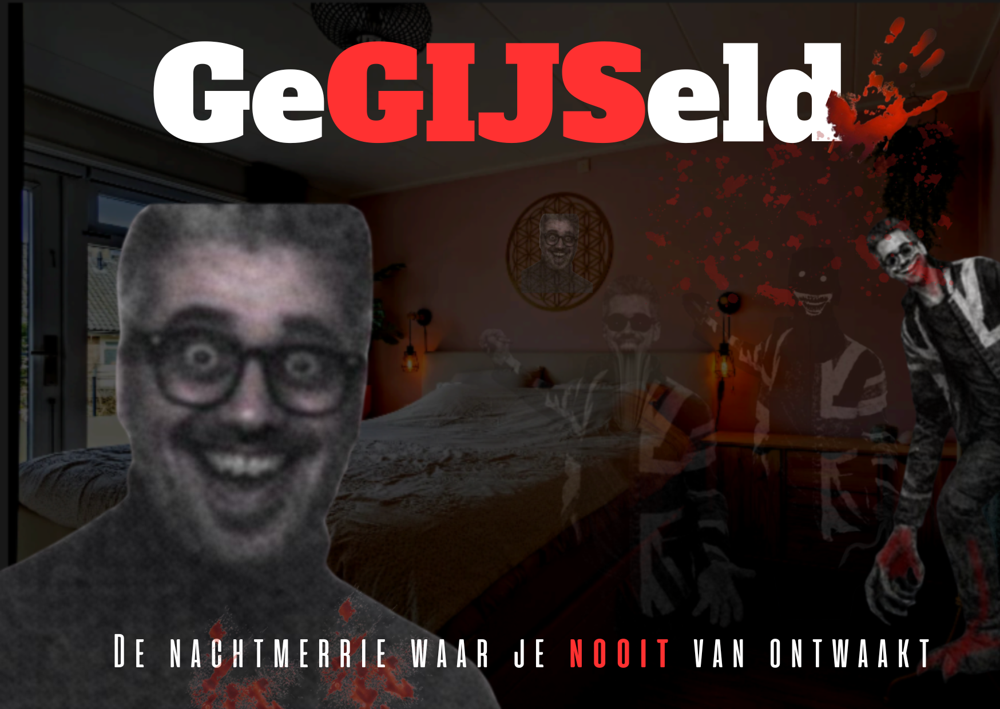

We lijden vaker in onze verbeelding dan in de werkelijkheid.
Je had hem nooit moeten bellen.
De gijzeler is er klaar voor.
Ontwaak jij aan de nachtmerrie? Of wordt je gegijzeld, voor eeuwig en altijd.
